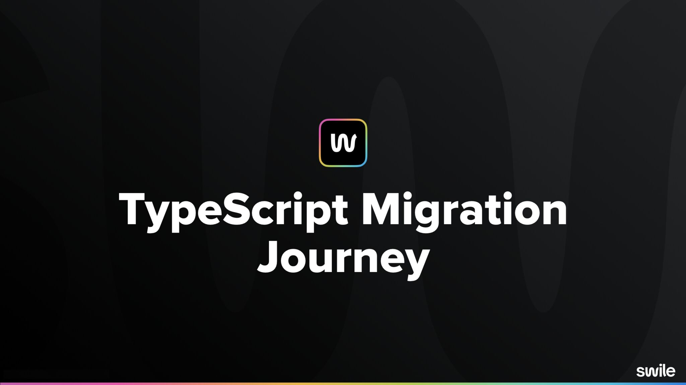

Apres 2 ans d'absence le [BreizhCamp](https://www.breizhcamp.org/) à fait son
retour dans les locaux de l'université de Rennes 1.

Cette édtion à été l'occasion pour moi de présenter 2 talks sur un sujet qui me
tiens à coeur: **TypeScript**

## Advanced TypeScript Patterns

> J'avais déja eu l'occasion de présenter ce talk dans un version simplifié lors
> d'une édition du [RennesJS](https://rennesjs.org)

## TypeScript Migration Journey

> Cette présentation est un retour d'éxpérience de la démarche mise en place de
> TypeScript au sein de mon équipe chez [Swile](https://swile.co/).

**TypeScript** est mon langage principal depuis pres de 7 ans (merci Angular 2
😍).

Lors de mon arrivée chez Swile, j'ai été confronté au challenge de me retrouver
face à une base de code JavaScript.
