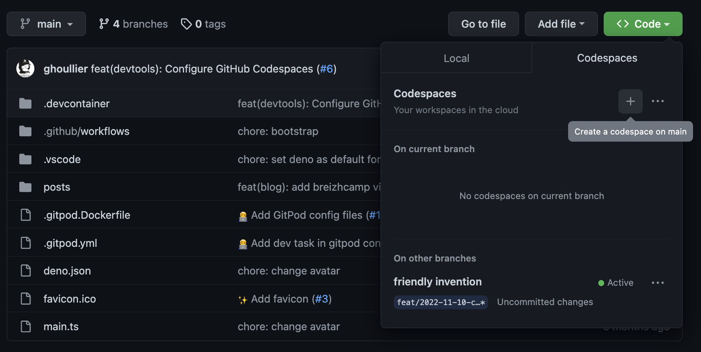

Lors de la dernière GitHub Universe, GitHub à annoncé sur
[Twitter](https://twitter.com/github/status/1590403103014420481) la
disponibilité de Codespaces pour l'ensemble des utilisateurs (60H par mois en
gratuit).

Codespaces est un environement de code basé sur VSCode dans le cloud, ça
ressemble énormément à [GitPod](https://gitpod.io).

## Installation

La
[configuration](https://docs.github.com/en/codespaces/setting-up-your-project-for-codespaces/adding-features-to-a-devcontainer-file?tool=vscode)
se fait via la création d'un dossier `.devcontainer`.

Le fichier `devcontainer.json` permet de préciser l'image Docker et les
extensions VSCode à installer.

> Pour le cas de ce blog, la PR de configuration de CodeSpace est dispo
> [ici](https://github.com/ghoullier/blog/pull/6)

Une fois configuré il n'y a plus besoin d'avoir un VSCode local, il suffit de
créer un codespace ou de se connecter à un existant.

## Conclusion

L'expérience de dev est vraiment fluide similaire à un VSCode local.

Je vais continuer à jouer avec dans les semaines à venir 👨‍💻.

> Cet article a été entièrement rédigé en utilisant GitHub Codespaces
