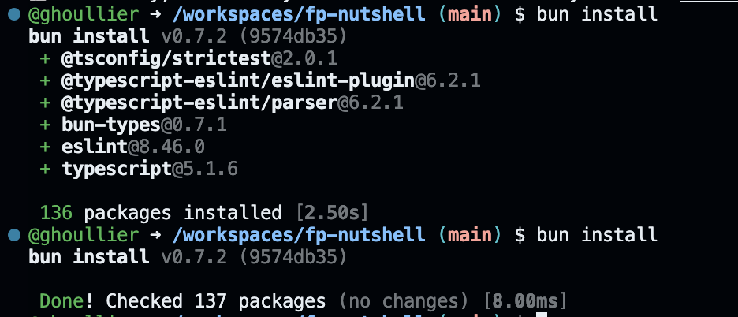
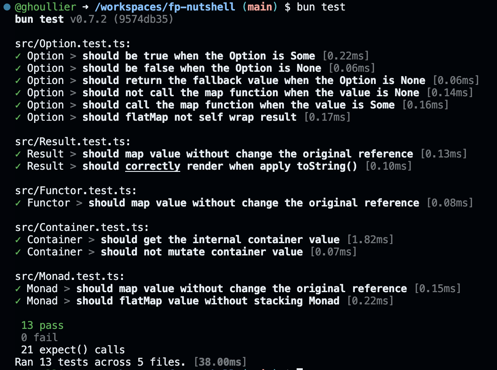

**Incredibly fast JavaScript runtime, bundler, test runner, and package manager
– all in one**

[**Bun**](https://bun.sh/) est un nouvel arrivant dans l'écosystem
**JavaScript**, il s'agit d'une chaine d'outil "tout-en-un" (runtime, bundler,
package manager, ...)

Contrairement à [**Deno**](https://deno.land/) **Bun** assume complètement
l'historique de **Node.js**, il supporte les **node_modules**, ainsi que de
[**CommonJS**](https://bun.sh/blog/commonjs-is-not-going-away).

Son créateur [Jarred Sumner](https://twitter.com/jarredsumner) est
particulièrement
[attentif aux performances](https://twitter.com/search?q=%40jarredsumner%20faster&src=typed_query).

## Différences sous le capot

- **Bun** est basé sur **JSCore** au lieu de **v8**
- **Bun** est écris en **Zig** au lieu de **Rust** et **C++**

## Différences visible

- **Bun** est compatible avec le système de résolution des **node_modules**
- **Bun** supporte la syntaxe TypeScript nativement, par contre il ne typecheck
  pas votre code, cela reste de la responsabilité de **tsc**

## 🐣 Premières impressions

> J'ai joué avec **Bun** dans le cadre de
> [fp-nutshell](https://github.com/ghoullier/fp-nutshell) un projet qui
> implémente certains pattern de programmation fonctionnelle.

### 🏎 Rapidité

**Bun** est vraiment rapide, l'installation des dépendances ne prend que
quelques secondes, de même pour l'éxécution des tests.

### 🔋 Efficacité

La philosophie de **Bun** est d'offrir un outil **tout-en-un**, pas besoin
d'installer Jest/Vitest, ESBuild/SWC.

### bun install

### bun test

## Limitations

`bun --bun` n'est pas encore compatible avec toute les modules npm mais le
développement de **Bun** avance vite et la v1.0 devrait arriver d'ici quelques
semaines, reste a espérer que cela sera résolu lors du passage en version
stable.

## Conclusion

**Bun** a le potentiel de changer la donne dans l'écosystème JavaScript.

Contrairement à Deno
[qui a été créé pour résoudre les problèmes de conception de NodeJS](https://medium.com/@imior/10-things-i-regret-about-node-js-ryan-dahl-2ba71ff6b4dc),
**Bun** a une approche moins clivante qui embrasse l'historique de NodeJS.
