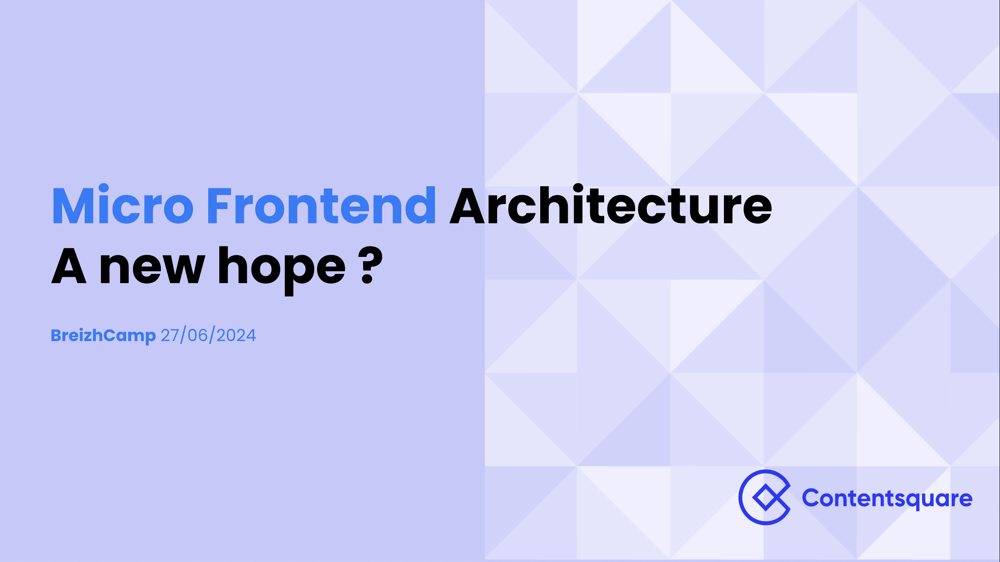

Pour l'édition [2024](https://breizhcamp.org/), j'ai eu l'occasion de faire un
retour d'expèrience sur l'architecture micro frontend. Lors de ce talk (moins
technique que ceux que j'ai l'habitude de donner), je présente les principes de
cette archi ainsi que les élements d'implémentation chez
[ContentSquare](https://contentsquare.com/)

## L'architecure micro-frontend, un nouvel espoir?

### 📺 Replay

**Pas encore disponible**

### 👨‍🏫 Slides

